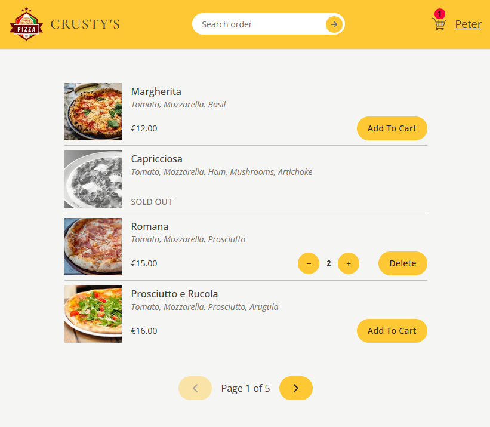

# React - Crusty's Pizza

# 🔗 [Live Preview](https://crusty-pizza.netlify.app/)
# ▶️ [Video walkthrough by dev](https://youtu.be/QE5tYT89XQc)

---

## Table of Contents

- [About Project](#about-project)
- [Features](#features)
- [How it works](#how-it-works)
- [Technologies & Dependencies used](#technologies--dependencies-used)
- [Prerequisites](#prerequisites)
- [Clone & Run locally](#clone--run-locally)
- [Project Structure](#project-structure)
- [Contributing](#contributing)

---

## About Project

Crusty's pizza simulates a local pizza business where people can order pizza online easily, to be delivered to their location. Users can choose from a variety of pizzas, add them to their cart, and input their details for delivery. The app also has a search feature to find orders quickly.

---

## Features

- **Menu Management:** Users can view a list of available pizzas with details and add or remove pizzas to, or from their cart. Quantity of each pizza item can be easily changed.

- **Cart Management:** Users can view details of the items in their cart, increase or decrease the quantity of each item, remove individual item or all items at once.

- **Order Management:** Users can create a new order by providing their name, phone number, and address. They can also choose to give their order priority for an additional cost and view the details of their order. Users can also search and see an order by its ID to view its details.

- **User Login/Log out:** Users can login and log out, and the app will remember the user across sessions using **only** local storage and not database and backend.

---

## How it works

### `/src/assets/` folder

- **Role:** This folder contains all the static assets used in the project, such as the logo of the application and background image used in the `Home` component.

### `/src/features/cart/` folder

- **Role:** This folder contains all the components and logic related to the shopping cart functionality.

- **Contents:**

  - `Cart.jsx`: Displays the items in the user's cart and provides options to clear the cart or proceed to order.

  - `CartItem.jsx`: Represents a single item in the cart, showing its name, quantity, and total price.

  - `cartSlice.js`: Contains the Redux slice for managing the cart state, including actions for adding, removing, and updating items.

  - `DeleteItem.jsx`: Provides a button to delete an item from the cart.

  - `EmptyCart.jsx`: Displays a message when the cart is empty and provides a link to go back to the menu.

  - `UpdateItemQuantity.jsx`: Provides buttons to increase or decrease the quantity of an item in the cart.

### `/src/features/menu/` folder

- **Role:** This folder contains all the components and logic related to displaying the menu of available pizzas.

- **Contents:**

  - `Menu.jsx`: Fetches and displays the list of available pizzas.

  - `MenuItem.jsx`: Represents a single pizza item in the menu,
    showing its name, ingredients, price, and image. Provides options to add the item to the cart.

### `/src/features/order/` folder

- **Role:** This folder contains all the components and logic related to managing orders.

- **Contents:**

  - `CreateOrder.jsx`: Provides a form for users to create a new order by entering their name, phone number, and address. Users can also choose to give their order priority.

  - `Order.jsx`: Displays the details of a specific order, including its status, priority, and total price.

  - `OrderItem.jsx`: Represents a single item in an order, showing its name, quantity, and total price.

  - `SearchOrder.jsx`: Provides a search bar for users to search for an order by its ID.

### `/src/features/user/` folder

- **Role:** This folder contains all the components and logic related to user authentication and profile management.

- **Contents:**

  - `InputUser.jsx`: Provides a simple form for users to enter their first name when they first visit the site, on the Homepage.

  - `userSlice.js`: Contains the Redux slice for managing the user state, including actions for creating, updating, and removing the user.

### `/src/services/` folder

- **Role:** This folder contains the `apiRestaurant.js` API service functions used to interact with the backend such as, functions for fetching the menu, creating orders, and fetching order details.

### `/src/ui/` folder

- **Role:** This folder contains the UI components used throughout the application.

- **Contents:**

  - `AppLayout.jsx`: Defines the layout of the application, including the header and main content area.

  - `Button.jsx`: A reusable button component with different styles.

  - `Error.jsx`: Displays an error message when something goes wrong.

  - `Header.jsx`: Displays the header of the application, including the logo, search bar, and user profile.

  - `Home.jsx`: The home page of the application, welcoming users.

  - `LinkButton.jsx`: A reusable link button component.

  - `Loader.jsx`: Displays a loading spinner when the application is fetching data.

### `/src/utils/` folder

- **Role:** This folder contains `helpers.js` which are utility functions.

### `/src/` folder

- **Role:** This folder contains the main application files.
- **Contents:**

  - `App.jsx`: The main application component that sets up the router and toast notifications.

  - `index.css`: The main CSS file for the application, including Tailwind CSS styles.

  - `main.jsx`: The entry point of the application, rendering the `App` component and setting up the Redux store.

  - `store.js`: Configures the Redux store and loads the user data from local storage.

---

## Technologies & Dependencies used

- **Vite:** For building the app (React + vanilla JavaScript).

- **API Integration:** The app integrates with a backend API to fetch menu items and manage orders. The API requests are handled using asynchronous functions.

- **Responsive Layout:** The app is designed to be responsive and works well on both desktop and mobile devices.

- **React:** For pretty much everything.

- **Tailwind:** For styling the app.

- **Redux toolkit:** For global state management.

- **React router:** For navigating different pages.

dependencies:

- "@reduxjs/toolkit": "^2.3.0",
- "react": "^18.2.0",
- "react-dom": "^18.2.0",
- "react-hot-toast": "^2.5.2",
- "react-icons": "^5.4.0",
- "react-redux": "^9.1.2",
- "react-router-dom": "^6.27.0",
- "sweetalert2": "^11.17.2"

devDependencies:

- "@babel/plugin-proposal-private-property-in-object": "^7.21.11",
- "@babel/plugin-transform-private-property-in-object": "^7.25.8",
- "@types/react": "^18.2.15",
- "@types/react-dom": "^18.2.7",
- "@vitejs/plugin-react": "^4.0.3",
- "autoprefixer": "^10.4.20",
- "eslint": "^8.57.1",
- "eslint-config-react-app": "^7.0.1",
- "eslint-plugin-react": "^7.32.2",
- "eslint-plugin-react-hooks": "^4.6.0",
- "eslint-plugin-react-refresh": "^0.4.3",
- "postcss": "^8.4.47",
- "prettier": "^3.3.3",
- "prettier-plugin-tailwindcss": "^0.6.8",
- "tailwindcss": "^3.4.14",
- "vite": "^4.4.5",
- "vite-plugin-eslint": "^1.8.1"

---

## Prerequisites

Ensure you have the following installed on your system:

    Node.js v18.00.0
    npm or yarn

---

## Clone & Run locally

1. **Clone the Repository:**

   - On the GitHub repo page, click the green "Code" button.

   - Copy the HTTPS URL.

2. **Open the Terminal:**

   - Open the terminal by typing "cmd" in your desktop's start menu, **OR**

   - Right-click on the desktop and select "Git Bash Here" (if you have Git Bash installed), **OR**

   - Open Visual Studio Code's terminal by clicking "Terminal" -> "New Terminal" inside the editor.

3. **Navigate to Your Project Location:**

   - In the terminal, navigate to your desired location (e.g., desktop) using the command: `cd desktop`. Adjust the path if your project is located elsewhere.

   - Ensure that your terminal's address is inside the project folder.

4. **Clone the Repository:**

   - Run the command: `git clone /link/`. Replace `/link/` with the HTTPS URL from step 1.

5. **Enter the Project Directory:**

   - Navigate into the cloned repository by typing: `cd /folder-name/`. Replace `/folder-name/` with the name of the cloned folder.

6. **Install Dependencies:**

   - Run the command: `npm install` to install all the necessary dependencies.

7. **Start the Project:**

   - Run the command: `npm run dev` or `yarn dev` to start the project. You will need to manually open the browser address at [localhost:5173/](http://localhost:5173/)

---

## Project Structure

├── public\
├── src\
│ ├── assets\
│ │ ├── (all images)\
│ ├── features\
│ │ ├── cart\
│ │ │ ├── Cart.jsx\
│ │ │ ├── CartItem.jsx\
│ │ │ ├── CartOverview.jsx\
│ │ │ ├── cartSlice.js\
│ │ │ ├── DeleteItem.jsx\
│ │ │ ├── EmptyCart.jsx\
│ │ │ ├── UpdateItemQuantity.jsx\
│ │ ├── menu\
│ │ │ ├── Menu.jsx\
│ │ │ ├── MenuItem.jsx\
│ │ ├── order\
│ │ │ ├── CreateOrder.jsx\
│ │ │ ├── Order.jsx\
│ │ │ ├── OrderItem.jsx\
│ │ │ ├── SearchOrder.jsx\
│ │ ├── user\
│ │ │ ├── InputUser.jsx\
│ │ │ ├── userSlice.js\
│ ├── services\
│ │ ├── apiRestaurant.js\
│ ├── ui\
│ │ ├── AppLayout.jsx\
│ │ ├── Button.jsx\
│ │ ├── Error.jsx\
│ │ ├── Header.jsx\
│ │ ├── Home.jsx\
│ │ ├── LinkButton.jsx\
│ │ ├── Loader.jsx\
│ ├── utils\
│ │ ├── helpers.js\
│ │ ├── Modal.jsx\
│ │ ├── useModal.jsx\
│ ├── App.jsx\
│ ├── index.css\
│ ├── main.jsx\
│ ├── store.js\
├── .eslintrc.cjs\
├── .gitignore\
├── .prettierrc\
├── index.html\
├── package-lock.json\
├── package.json\
├── postcss.config.js\
├── README.md\
├── tailwind.config.js\
├── vite.config.js\

---

## Contributing

Contributions are closed at the moment.
